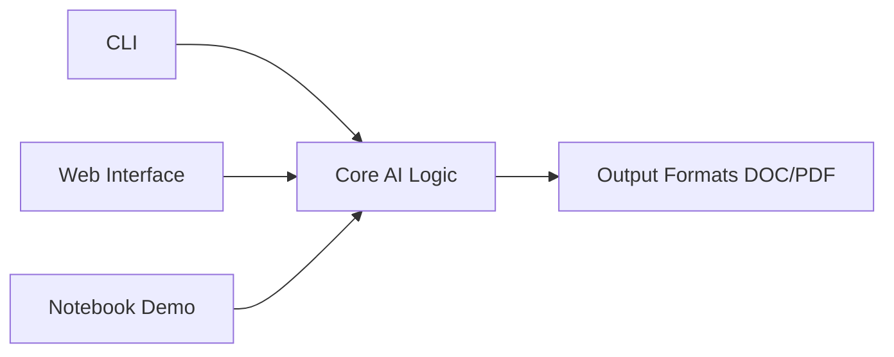

# ESoC 2025 challenge - ecoSPECS


### 1. parsing tables

Wrote python CLI code to parse all tables in a Word or `pdf` document, producing a list-of-2D-array-like structure (one 2D array per table).

```bash
 python -m src.ecospecs.cli parse file-path
 ```


### 2. filling tables using GenAI

Can Fill the table using command like:

```bash
 python -m ecospecs.cli generate     "Technical specifications for lab centrifuges"     "Model,Max RPM,Capacity,Noise Level"     -o output/centrifuge_specs.docx
 ```


Bonus 1: used Microsoft's Phi-3-mini (3.8B parameters) with 4-bit quantization` model

Bonus 2: include the ability to generate tables from scratch, including rows and columns.

Bonus 3: add a feature to write to `doc` or `pdf` file format with a short introduction paragraph.

### Bonus: towards a pre-prototype

I have created a CLI for this AI tool. However, I think the less code I can make visible, its better for non tech people. Thus in future, it is better to shift into dashboard, or having [interactive mode in CLI](https://github.com/scribe-org/Scribe-Data/pull/167) for better user experience.


