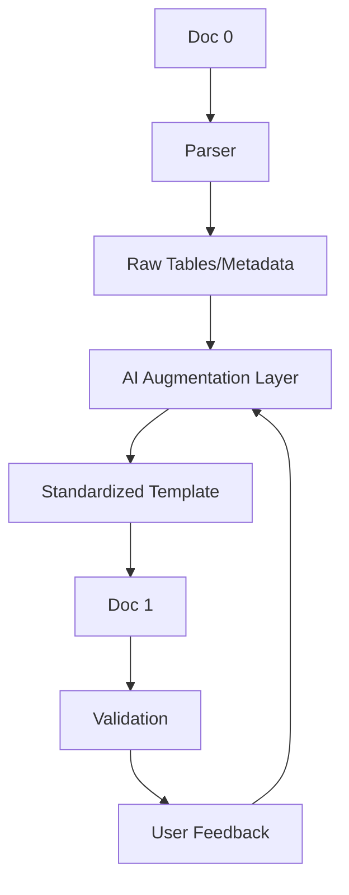

## Architecture Diagram

```mermaid
graph TD
    A[Doc 0] --> B[Parser]
    B --> C[Raw Tables/Metadata]
    C --> D[AI Augmentation Layer]
    D --> E[Standardized Template]
    E --> F[Doc 1]
    F --> G[Validation]
    G --> H[User Feedback]
    H --> D
```